Luxion
================

An advanced glTF GPU path tracer built with CUDA and OptiX.

- **Saahil Gupta**
  - [Website](https://www.saahil-gupta.com)
  - [LinkedIn](https://www.linkedin.com/in/saahil-g)
  - [X](https://x.com/cbizcuit)

<p align="center">
  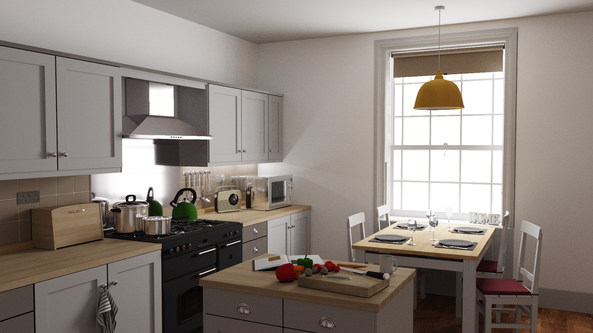
</p>

## Gallery

<p align="center">
  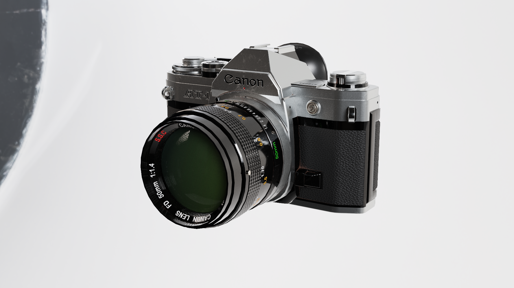
  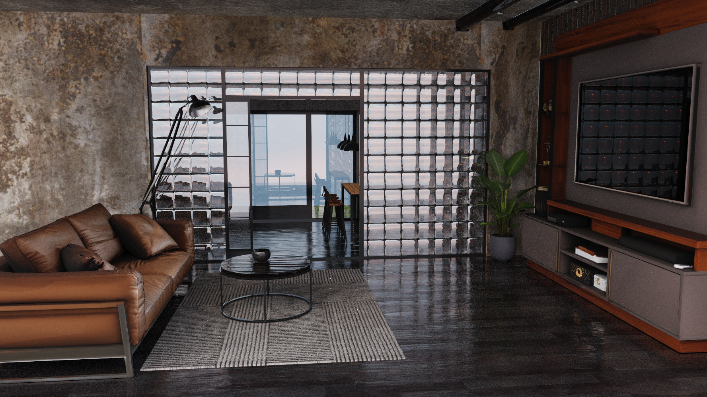
</p>
<p align="center">
  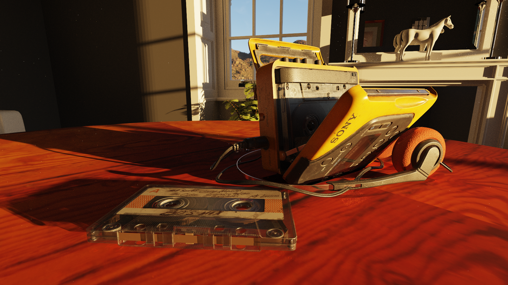
  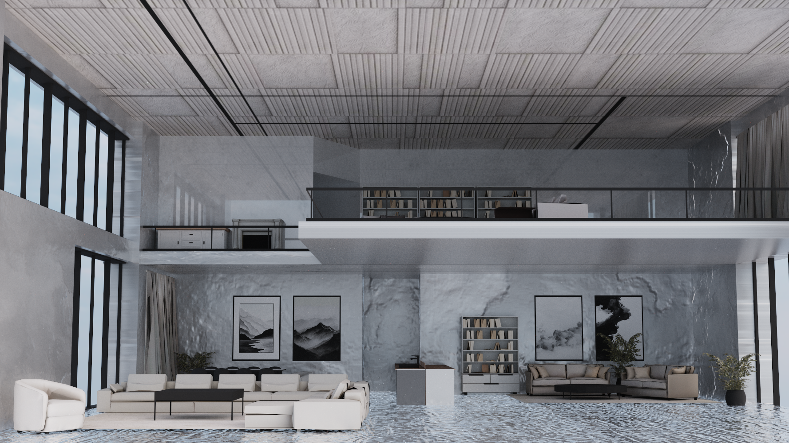
</p>
<p align="center">
  
  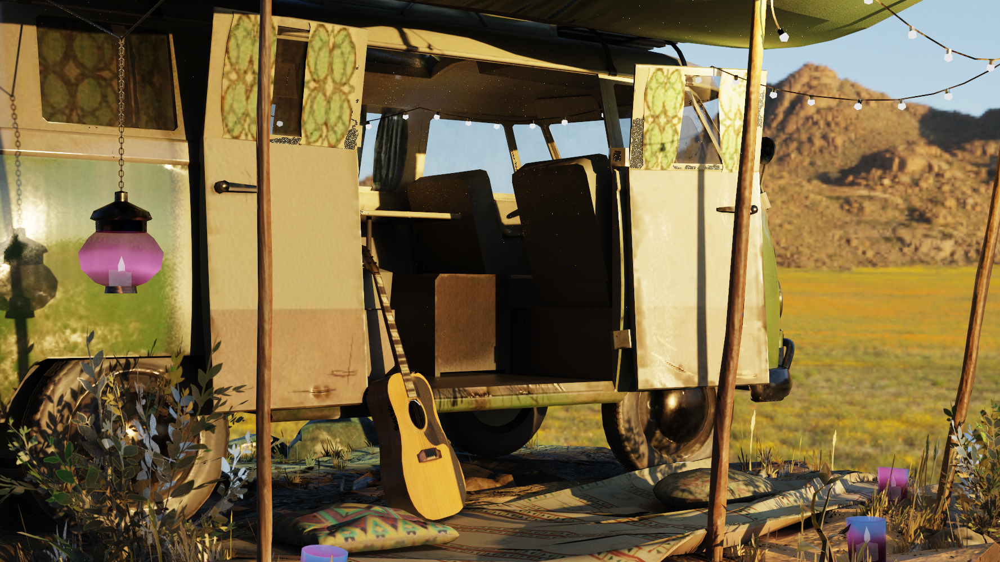
</p>


## Rendering

### Hardware Acceleration

Luxion traces rays with **NVIDIA OptiX**, utilizing the RT cores on RTX GPUs for BVH traversal and triangle intersection. Each mesh gets its own compacted GAS, which all sit under a IAS.

Every bounce, OptiX traces at most three kinds of rays per path:
- BSDF indirect light ray
- Direct light shadow ray
- Environment map shadow ray

Alpha-masked and alpha-blended materials are handled in an **any-hit program**, which samples the material's alpha and either rejects the hit (mask) or keeps it with probability of alpha (blend).

### Materials

All materials go through a single **Cook-Torrance Uber-shader**, with the following parameters:
- Albedo
- Roughness
- Metallic
- Emission
- Transmission
- Alpha
- IOR

These parameters are implemented through three sampling lobes:
- **GGX (Trowbridge-Reitz) microfacet BRDF** for specular reflection.
- **Lambertian diffuse BRDF** for non-metals.
- **Microfacet transmission GGX BTDF** covers rough and smooth glass refraction.

Our fresnel is computed through **Schlick Fresnel approximation** and **IOR-based Dielectric Fresnel**, which are blended by *metallic*.

Supported textures are base color, normal, metallic-roughness, and emission, which spans the set of all material parameters apart from transmission.

<p align="center">
  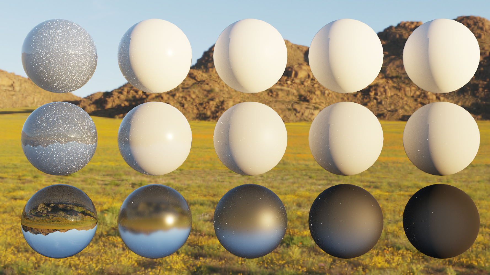
</p>

### Importance Sampling

- **Next-event estimation:** At each non-specular hit, Luxion samples a point on an emissive mesh by picking a mesh through a CDF over total emissive area, then a triangle within that mesh by area, then a uniform point on that triangle.
- **HDRI environment importance sampling:** The environment map is turned into a 2D distribution: a marginal CDF over rows and a conditional CDF per row, weighted by each pixel's brightness and $\sin \theta$. 
- Both are combined with BSDF sampling using **MIS** and the power heuristic.

<table align="center">
  <tr>
    <td align="center" width="50%">
      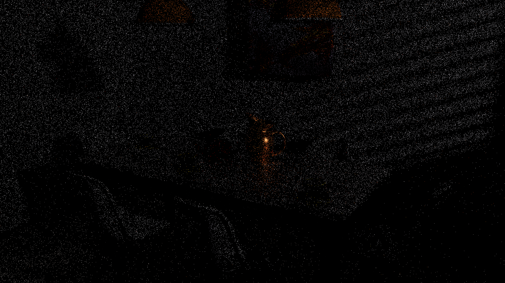<br>
      <em>Without NEE</em>
    </td>
    <td align="center" width="50%">
      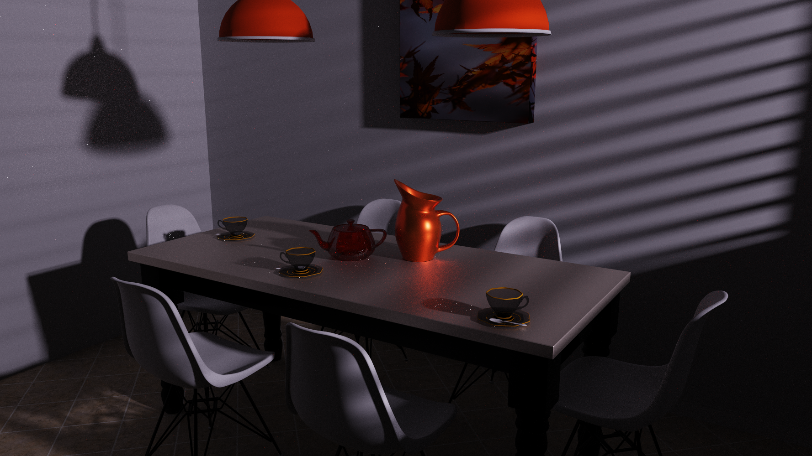<br>
      <em>With NEE</em>
    </td>
  </tr>
</table>


<table align="center">
  <tr>
    <td align="center" width="50%">
      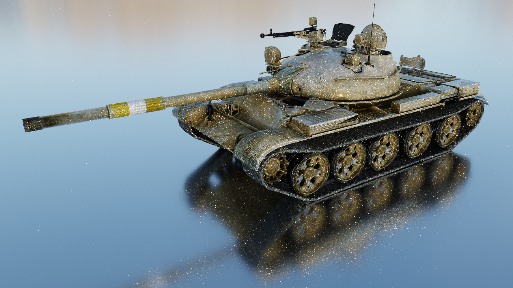<br>
      <em>Without environment importance sampling</em>
    </td>
    <td align="center" width="50%">
      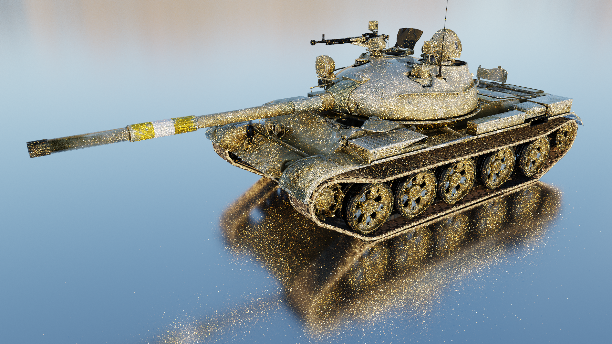<br>
      <em>With environment importance sampling</em>
    </td>
  </tr>
</table>

### Optimizations

- **Wavefront path tracing:** each bounce is split into separate kernels and stages
- **Stream compaction via atomic index queue:**
  - `shadePath` appends each surviving path's index to a queue for the next bounce.
  - Survivors are pushed with a warp-aggregated `atomicAdd`.
  - Later bounces only launch threads for live paths.
- **Caching Thrust allocator:** temporary buffers are reused across calls instead of reallocating.

### Scene Loading

Scenes are loaded from **glTF 2.0** (`.glb`) with tinygltf:
- **Cameras:** the scene's glTF camera is used as the starting view.
- **Materials and textures** are mapped onto the uber-shader as described above.
- **Emissive meshes** are gathered into the area-weighted light list for NEE automatically.
- **HDRI environment maps** are loaded from `.exr` files.
- Textures support texture transforms with `KHR_texture_transform`
- Material parameters use extensions `KHR_materials_emissive_strength`, `KHR_materials_ior`, and `KHR_materials_transmission`

### Additional

- Reinhard, AgX and ACES tonemapping
- ImGUI UI for live scene editing, analytics, and profiling data
- Software BVH with binning-SAH construction (*deprecated*)
- Material sorting (*deprecated*)
- JSON scene loading (*deprecated*)
- Ray Morton encoding (*deprecated*)
- Additional material types (*deprecated*)
  - Perfect Lambertian
  - Perfect Specular
  - Perfect Glass

## Usage

```
luxion SCENEFILE [-e|--envmap ENVMAP] [-i|--iterations N] [-o|--output NAME] [-dmis] [-emis] [-lock]
```

| Flag | Description |
|---|---|
| `SCENEFILE` | `.glb` scene (or legacy `.json`) |
| `-e`, `--envmap` | HDRI environment map (`.exr`) |
| `-i`, `--iterations` | Samples per pixel; the image is saved and the program exits when reached (default `5000`) |
| `-o`, `--output` | Output path without extension (default `img/<scene>.<timestamp>.<spp>samp`) |
| `-dmis` | Direct light sampling with MIS (requires emissive geometry) |
| `-emis` | Environment map importance sampling with MIS (requires `-e`) |
| `-lock` | Start with the camera and settings locked |

### Example
```
luxion scenes/interior_apartment.glb -e scenes/exr/citrus_orchard_road_puresky_4k.exr -i 5000 -o img/best/interior_apartment -emis -lock
```

`run_best_scenes.ps1` batch-renders every line of `best_scenes.txt` with `build/bin/luxion.exe`.

### Controls

| Input | Action |
|---|---|
| `W` `A` `S` `D` | Move forward / left / back / right |
| `E` / `Q` | Move up / down |
| Arrow keys | Orbit around the focus point |
| Left drag | Orbit |
| Shift + left drag, middle drag | Pan |
| Right drag, scroll | Zoom |
| `Space` | Reset camera |
| `I` | Save image |
| `H` | Toggle UI |
| `Esc` | Save image and quit |


## Performance

// TODO

## Building

### Requirements

- Windows 10/11 with Microsoft Visual Studio 2022
- [CUDA Toolkit](https://developer.nvidia.com/cuda-downloads) 13.x
- [OptiX SDK](https://developer.nvidia.com/designworks/optix/download) 9.1
- CMake 3.24+
- An NVIDIA RTX GPU
- [Git LFS](https://git-lfs.com/) for large scenes in `scenes/lfs/` (optional)

### Setup

1. Clone with LFS:
   ```
   git lfs install
   git clone https://github.com/seabiscuit-iv/luxion.git
   ```
2. Point the `OPTIX_SDK` environment variable at your OptiX install so CMake can find `optix.h`:
   ```
   setx OPTIX_SDK "C:\ProgramData\NVIDIA Corporation\OptiX SDK 9.1.0"
   ```
### Build

```
cmake -B build -G Ninja -DCMAKE_BUILD_TYPE=Release
cmake --build build
```

The executable is written to `build/bin/luxion.exe`. It must be run from the repository root, since the OptiX shaders are loaded from `src/optixshaders/` at runtime.

### Compile-time Options

Set in [`include/config.h`](include/config.h):

| Flag | Description |
|---|---|
| `OPTIX` | OptiX hardware tracing (`1`) or the software BVH (`0`) |
| `STREAM_COMPACTION` | Compact terminated paths between bounces |
| `RAY_SORTING` | Morton-sort the path queue before tracing |
| `PROFILE` | CUDA event timing, plus the Stage Timings and GPU Utilization windows |
| `UBER_SHADER` | Single Cook-Torrance shader (`1`) or the legacy per-material shaders (`0`) |
| `RUSSIAN_ROULETTE_MIN_DEPTH` | First bounce at which Russian roulette can terminate paths |

## Additional Renders

// TODO

## Roadmap

// TODO

## Acknowledgements

// TODO